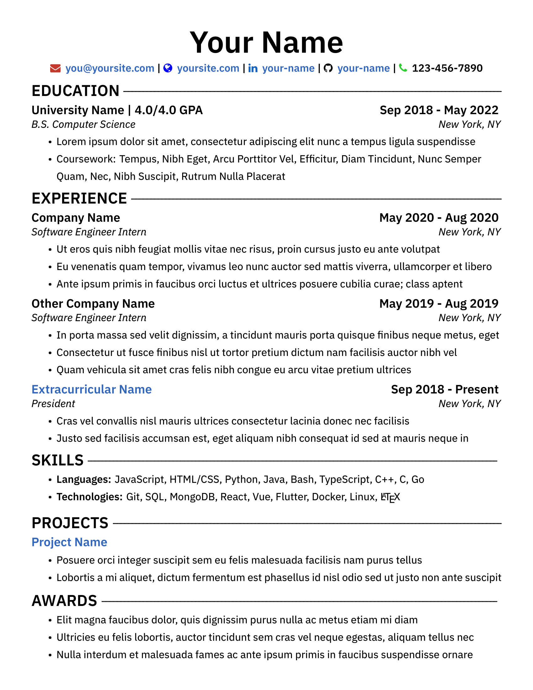

# resume-template

A single-column resume template with colored icons and links

## How to Compile

1. [Download resume-template.tex and resume-template.cls](https://github.com/MdAbedin/resume-template/blob/master/resume-template.zip?raw=true) and upload them to a new blank [Overleaf](https://www.overleaf.com/) project.
2. Click "Menu" on the top left and set the compiler to "LuaLaTeX"
3. Click "Recompile"
